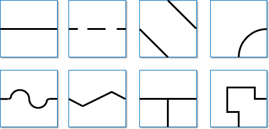

== Field

=== Description

. The field is made up of modular tiles, which can be used to make an endless number of different courses for the robots to traverse.

. The field will consist of 30 cm x 30 cm tiles, with different patterns. The final selection of tiles and their arrangement will not be revealed until the day of the competition. Competition tiles may be mounted on a hard-backing material of any thickness.

. There will be a minimum of 8 tiles in a competition field, excluding the start and goal tile.

. There are different tile designs (examples can be found under <<Line>>).

=== Floor

. The floor is white in colour. The floor may be either smooth or textured (like linoleum or carpet) and may have steps of up to 3 mm height in between tiles. Due to the nature of the tiles, there may be a step and/or gaps in the construction of the field.

. Competitors should be aware that tiles may be mounted on thick backing or raised off the ground, which may make it difficult to get back on a tile where the robot comes off the course. No provision will be made to assist robots that drive off of a tile to get back onto the tile.

. Robots must be designed so that they can navigate under tiles that form bridges over other tiles. Tiles
placed above other tiles will be supported by pillars placed at tile corners with a square cross section
of 25mm x 25mm, making each tile entrance/exit 25 cm. The minimum height (space between the floor and the ceiling) will be 25 cm.

=== Line

. The black line, 1-2 cm wide, may be made with standard electrical insulating tape or printed onto paper or other materials. The black line forms a path on the floor. (The grid lines indicated in the drawings below are for reference only and competitors can expect tiles to be added and/ or omitted.)

. Straight sections of the black line may have gaps with at least 5 cm of straight line before each gap as measured from the shortest portion of the straight portion of the line. The length of a gap will be no more than 20 cm.

. The arrangement of the tiles and paths may vary between rounds.

. The line will be 10 cm away from any edge of the field, walls, pillars to support ramps, seesaws, and obstacles
that do not lie ahead of the path of the robot.

=== Checkpoints

. A checkpoint is a tile which a robot will be manually placed back when a lack of progress occurs.

. Checkpoints will not be located on tiles with scoring elements.

. The start tile is a checkpoint where the robot can restart.

. A checkpoint marker is the marker that indicates for humans which tiles are checkpoints. A disk
with 5 mm to 12 mm thickness and up to 70 mm in diameter has been used frequently, but can be
different dependent on the organizer.

. The number of checkpoint markers and their locations will be predetermined by the field designers.

=== Speed Bumps, Debris and Obstacles

. Speed bumps will have a height of 1 cm or less and will be white. When the speed bump is placed over any black line, the overlap between the speed bump and the black line will be coloured black.

. Debris will have a maximum height of 3 mm. It will not be fixed to the floor. Debris consists of small materials such as toothpicks or small wooden dowels, etc.

. There will be no bumpers, debris or obstacles in the evacuation zone.

. There will be no bumpers on tiles with elements you can score points with (e.g. gaps, intersections, ramps).

. Obstacles may consist of bricks, blocks, weights and other large, heavy items. Obstacles will be at least 15 cm high, and can be fixed to the floor.

. An obstacle will not occupy more than one line and/or tile.

. There will be free space in a radius of 25 cm around each obstacle, to allow the robot to pass on both sides of the obstacle.

. A robot is expected to navigate around obstacles. The robot may move obstacles but it should be noted that obstacles may be very heavy or fixed to the floor. Obstacles that are moved will remain where they were moved to, even if that prevents the robot from proceeding.

. Obstacles will not be placed closer than 25 cm from the edge of the field and inclined tiles.

=== Intersections and Dead Ends

. Intersections can be placed anywhere except in the evacuation zone.

. There will be no gaps or bumpers on the tile ahead of an intersection.

. There will be no intersection markers (see Rescue Line rules for reference). Instead the organization committee will announce the direction of the path before a round is going to start (At least 30 minutes before the first scoring run). The direction of the path (left or right) may differ from round to round.

. There will be no dead ends.

. The intersections are always perpendicular but may have 3 or 4 branches.

=== Ramps

. Tiles will be used as ramps to allow the robots to 'climb' up and down from different levels.

. Ramps will not exceed an incline of 25 degrees from the horizontal.

. More than one tile may be used to build one ramp up or down. Despite the number of tiles used in the construction, the ramp will be scored as one ramp as it takes from one level to another.

. The ramp will be scored when the robot reaches the horizontal tile at the upper level after an ascending ramp or the horizontal tile at the bottom level after a descending ramp.

. The ramp will have a straight line with no scoring elements present.

=== Seesaws

. A seesaw is comprised of a tile which can pivot around a hinge placed in the centre of a regular tile.

. The seesaw will have an incline of less than 20 degrees when tilted to one side.

. The seesaw tile will have a straight line with no scoring elements present.

image::media/line/Seesaw.jpg[]

=== Evacuation Zone

. The black line will end at the entrance of the evacuation zone.

. The evacuation zone is 120 cm by 90 cm with walls around the 4 sides that are at least 10 cm high and coloured white.

. At the entrance to the evacuation zone, there is a 25 mm x 250 mm strip of reflective silver tape on the floor.

. The evacuation point is a black triangle with a bump of 5mm along the side that does not touch a wall.

. The evacuation point can be placed in any of the non-entry/exit corners in the evacuation zone.

. After a Lack of Progress, the referee may roll the dice again and place the evacuation point in a new corner.

. The evacuation point will be fixed to the floor, but teams should be prepared for slight movements in the evacuation point.

=== Victims

. Victims may be located anywhere on the floor of the evacuation zone.

. A victim represents a person and is in the form of a 4-5 cm diameter sphere with an off-center center of mass and a maximum weight of 80 g.

. There are two types of victims:

* Dead victims are black and not electrically conductive.
* Living victims are silver, reflect light and are electrically conductive.

. The victims will be located in a random manner in the evacuation zone. There will be exactly two live victims and one dead victim placed in the evacuation zone.

=== Environmental Conditions

. The environmental conditions at a tournament may be different from the conditions at home.  Teams must come prepared to adjust their robots to the conditions at the venue.

. Lighting and magnetic conditions may vary in the rescue field.

. The field may be affected by magnetic fields (e.g. generated by under floor wiring and metallic objects). Teams should prepare their robots to handle such interference.

. The field may be affected by unexpected lighting interference (e.g. such as camera flash from spectators). Teams should prepare their robots to handle such interference.

. All measurements in the rules have a tolerance of ±10%.

