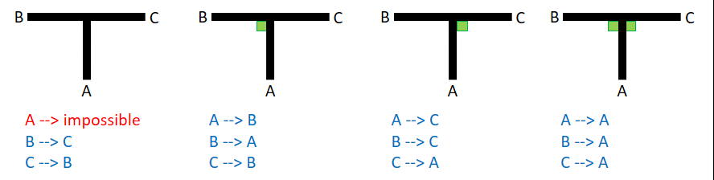
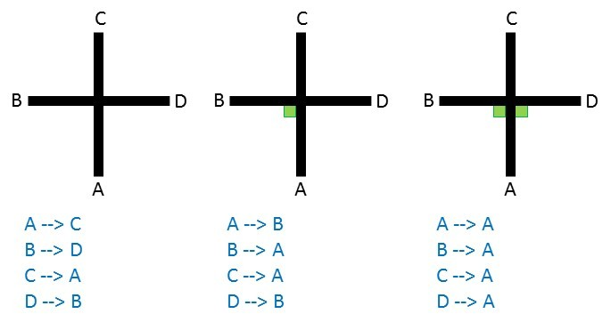
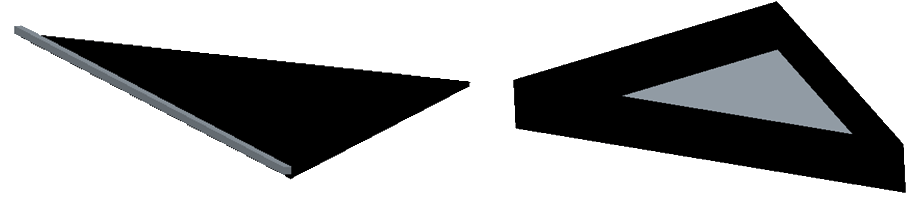

== Field

=== Description

The field is made up of modular tiles, which can be used to make an endless number of different courses for the robots to traverse.

The field will consist of 30 cm x 30 cm tiles, with different patterns. The final selection of tiles and their arrangement will not be revealed until the day of the competition. Competition tiles may be mounted on a hard-backing material of any thickness.

There will be a minimum of 8 tiles in a competition field.

There are different tile designs (examples can be found under <<field-line>>).

=== Floor

The floor is white in colour. The floor may be either smooth or textured (like linoleum or carpet) and may have steps of up to 3 mm height in between tiles. Due to the nature of the tiles, there may be a step and/or gap in the construction of the field. These are not intentional and will be minimized as much as possible by the organizers.

Competitors should be aware that tiles may be mounted on thick backing or raised off the ground, which may make it difficult to get back on a tile where the robot comes off the course. No provision will be made to assist robots that drive off of a tile to get back onto the tile.

Tiles will be used as ramps to allow the robots to "climb" up to and down from different levels. Ramps will not exceed an incline of 25 degrees from the horizontal.

Robots must be designed so that they can navigate under tiles that form bridges over other tiles. The minimum height (space between the floor and the ceiling) will be 25 cm.

[[field-line]]
=== Line

The black line, 1-2 cm wide, may be made with standard electrical insulating tape or printed onto paper or other materials. The black line forms a path on the floor. (The grid lines indicated in the drawings are for reference only and competitors can expect tiles to be duplicated, added and/ or omitted.)

Straight sections of the black line may have gaps with at least 5 cm of straight line before each gap as measured from the shortest portion of the straight portion of the line. The length of a gap will be no more than 20 cm.

The arrangement of the tiles and paths may vary between rounds.

The line will be 10 cm away from any edge of the field.

=== Speed Bumps, Debris and Obstacles

Speed bumps will have a height of 1cm or less and will be white. When the speed bump is placed over any black line, the overlap between the speed bump and the black line will be coloured black.

Debris will have a maximum height of 3 mm. It will not be fixed to the floor. Debris consists of small materials such as toothpicks or small wooden dowels, etc.

Debris may be adjacent to walls.

Obstacles may consist of bricks, blocks, weights and other large, heavy items. Obstacles will be at least 15cm high.

An obstacle may not occupy more than one line.

A robot is expected to navigate around obstacles. The robot may move obstacles but it should be noted that obstacles may be very heavy or fixed to the floor. Obstacles that are moved will remain where they moved to, even if that prevents the robot from proceeding.

=== Intersections and dead ends

Intersections can be placed anywhere except in the evacuation zone.

Intersections markers are green and 25 mm x 25 mm in dimension. They indicate the direction of the path the robot should follow.

If there is not a green marker at an intersection, the robot should continue straight ahead.

A dead end is when there are two green marks before an intersection (one on each side of the line), in this case the robot should turn around.

The intersections are always perpendicular but may have 3 or 4 branches.

Intersection markers will be placed just before the intersection. See the images below for possible scenarios.

image::media/line/intersections_possibilities_3.jpg[]

=== Doorway

The field layout may have doorways. If present in a field, doorways will be at least 25 cm wide and 25 cm high.

Doorways are located on straight sections of the line.

Doorways will be fixed to the floor.

=== Evacuation Zone

The black line will end at the entrance of the evacuation zone.

The evacuation zone is approximately 120 cm by 90 cm with walls around the 4 sides that are at least 10 cm high.

At the entrance to the evacuation zone, there is a 25 mm x 250 mm strip of reflective silver tape on the floor.

Teams can choose between two different evacuation point tiles, which are both right angled triangles with sides of 30 cm x 30 cm:

* Level one: The evacuation point is a black triangle with a bump of 5mm along the side that does not touch a wall.
* Level two: The evacuation point is a black triangle with 6cm walls and a hollow centre.

Level one and Level two

=== Victims

Victims may be located anywhere on the floor of the evacuation zone.

A victim represents a person and is in the form of a 4-5 cm diameter ball.

There are two types of victims:

* Dead victims are black and not electrically conductive.
* Living victims are silver, reflect light and are electrically conductive.

=== Environmental Conditions

The environmental conditions at a tournament will be different from the conditions at home practice field.  Teams must come prepared to adjust their robots to the conditions at the venue.

Lighting and magnetic conditions may vary in the rescue field.

The field may be affected by magnetic fields (e.g. generated by under floor wiring and metallic objects). Teams should prepare their robots to handle such interference. Organizers and referees will do their best to minimize external magnetic interference.

The field may be affected by unexpected lightning interference (e.g. such as camera flash from spectators). Teams should prepare their robots to handle such interference. Organizers and referees will do their best to minimize external lighting interference.

All measurements in the rules have a tolerance of ±5%.

