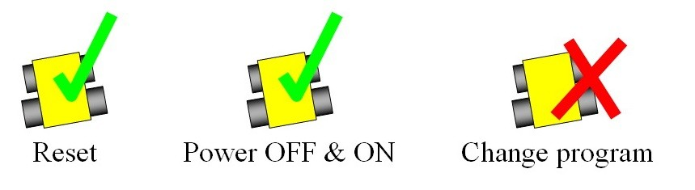
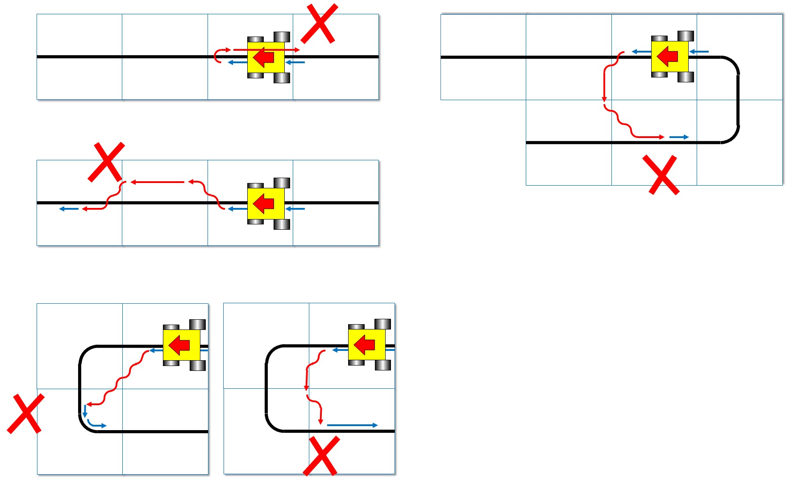

== Play

=== Pre-game Practice

. When possible, teams will have access to practice fields for calibration and testing throughout the competition.

. Whenever there are dedicated independent fields for competition and practice, it is at the organizers' discretion if testing is allowed on the competition fields.

=== Humans

. Teams should designate one of their members as "captain" and another one as "co-captain". Only these two team members will be allowed access to the competition fields, unless otherwise directed by a referee. Only the captain will be allowed to interact with the robot during a scoring run.

. The captain can move the robot only when they are told to do so by a referee.

. Other team members (and any spectators) within the vicinity of the competition field have to stand at least 150 cm away from the field at all times, unless otherwise directed by a referee.

. No one is allowed to touch the fields intentionally during a scoring run.

. Any and all pre-mapping activities will result in immediate disqualification of the robot for the
round. Pre-mapping is the act of humans providing the robot with information about the field (e.g.:
location of obstacles, entrance to the evacuation zone, number of tiles after the evacuation zone,
etc…) prior to the game.

=== Start of Game
. Each team has a maximum of 8 minutes for a game. The game includes the time for calibration and
the scoring run.

. Calibration is defined as taking sensor readings and modifying the robot’s programming to
accommodate such sensor readings. Calibration does not count as pre-mapping.

. The scoring run is defined as the time when the robot is moving autonomously to navigate the field,
and the referee will record the scores.

. A game begins at the scheduled starting time whether or not the team is present or ready. Start times
will be posted around the venue.

. Once the game has begun, the robot is not permitted to leave the competition area.

. Teams may calibrate their robot in as many locations as desired on the field, but the clock will
continue to run. Robots are not permitted to move on their own while calibrating.

. Once a team is ready to start a scoring run, they must notify the referee. To begin a scoring run, the
robot is placed on the start tile of the course as indicated by the referee. Once a scoring run has
begun, no more calibration is permitted, including changing of code/code selection.

. Teams may choose not to calibrate the robot and instead immediately start the scoring run.

. Once a robot begins its scoring run, the referee will roll a standard 6-sided dice to determine in
which corner the evacuation point will be located.

. Individual tiles, obstacles, and other scoring elements may be removed, added, or changed when the
robot starts moving (as the scoring run begins), to prevent teams from pre-mapping the layout of the
fields. This may happen on the basis of a die rolled by the referee or with another method of
randomization announced by the organizers. For a particular field during a round, the referee will
ensure the difficulty of the field will be kept similar and the maximum points to be constant.

=== Scoring Run

. Robots will start behind the joint of the start tile and the subsequent tile along the course. Correct placement will be checked by the referee.

. Modifying the robot during a scoring run is prohibited, which includes remounting parts that have fallen off.

. Any parts that the robot loses intentionally or unintentionally will be left in the field until the run is over. Team members and referees are not allowed to move or remove parts from the field during a scoring run.

. Teams are not allowed to give their robot any advance information about the field. A robot is supposed to recognize the field elements by itself.

. The robot must follow the course completely to enter the evacuation zone.

. The robot has visited a tile when more than half the robot is within that tile when viewed from above.

=== Lack of Progress

. A lack of progress occurs when:
.. a team captain declares a lack of progress.
.. a robot loses the black line without regaining it by the next tile in the sequence (see figures at end of the section).
.. a robot reaches a line that is not in the intended sequence.
+
NOTE: "sequence" is not including diagonal sequence

. If a lack of progress occurs, the robot must be positioned on the previous checkpoint tile facing the path towards the evacuation zone and checked by the referee.

. After a lack of progress, the team must reset the robot by using a switch/button(s) located in a clearly visible location by the referee (see 3.2.8).
+

. There is no limit to the number of lack of progresses within a round.

. After three failed attempts to reach a checkpoint, a robot is allowed to proceed to the next checkpoint.

. The team captain may choose to make further attempts at the course to earn the additional points available from scoring elements that have not already been earned before reaching the next checkpoint.

. If a lack of progress occurs in the evacuation zone, all victims (including ones that have rolled) will remain in their current position. Victims that are held by the robot will be placed roughly on the location of the robot when the lack of progress occurred. If a lack of progress occurs as the robot exits the evacuation zone whilst carrying victims, the victims will be randomly placed in the evacuation zone.

. Any seesaws ahead of the robot's path can be moved to the favourable direction when a lack of progress is called.

=== Scoring

. A robot is awarded points for successfully navigating each hazard (gaps in the line, speed bumps,
intersections, ramps, obstacles, and seesaws). Points are awarded per hazard when the
robot has reached the subsequent tile in sequence. A ramp as a hazard accounts for all of the
inclined tiles that make up one ramp. Point allocations are, 10 points per gap, 15 points per obstacle,
10 points per intersection, 10 points per ramp, 5 points per speed bump, and 15 points per
seesaw.

. Failed attempts at navigating hazards in the field are defined as a Lack of Progress (see <<Lack of Progress>>).

. When a robot reaches a checkpoint tile it will earn points for each tile it has passed since the previous checkpoint. The points per tile depend on how many attempts the robot has made to reach the checkpoint:

* 1st attempt = 5 points/tile
* 2nd attempt = 3 points/tile
* 3rd attempt = 1 points/tile
* Beyond the 3rd attempt = 0 points/tile
+
image::media/line/tile_scoring_example_1.png[float="left"]
image::media/line/tile_scoring_example_2.png[float="left"]

. Each gap, speed bump, intersection, dead end, obstacle, ramp, and seesaw can only be scored once
per intended direction through the course. Points are not awarded for subsequent attempts through
the course.

. Successful victim rescue: Robots are awarded multipliers for successfully rescuing victims. A
successful victim rescue occurs when the victim is moved completely into the evacuation point, and
no part of the robot can be in contact with the victim. When the referee determines there has been a
successful victim rescue, the victim will be removed from the evacuation point to allow more victims
to be evacuated. The multipliers are allocated as such:

.. x1.4 per successful rescue of a living victim
.. Dead victims will result in the same multiplier as the live victim if at least one live victim has
been successfully evacuated.
.. x1.2 if only the dead victim is evacuated

. When a lack of progress occurs inside of the evacuation zone, 0.05 will be
deducted from each of the obtained multiplier (however multipliers will not be less than 1).

. Multiplier values obtained throughout the scoring run will be directly multiplied together to the sum
of all the other points gained during the scoring run.

. The multipliers obtained from evacuations are used to increase the scores obtained from the line
tracing course. The scores will be rounded to the nearest integer in each round.

. Ties in scoring will be resolved based on the time taken by each robot (or team of robots) to complete
the course (this includes calibration time).

=== End of Game

. A team may elect to stop the game early at any time. In this case, the team captain must indicate to the referee the team's desire to terminate the game. The team will be awarded all points earned up to the call for the end of the game.
The referee will stop the time at the end of game which will be recorded as the game time.

. The game ends when:

.. the 8 minutes of allowed game time expires
.. the team captain calls the end of the game
.. the robot has successfully evacuated all victims.
