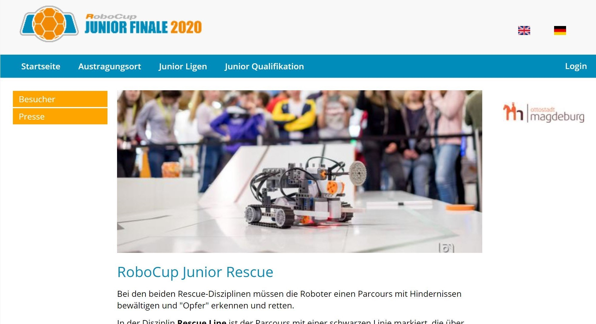

= RoboCupJunior Rescue Line Entry - Rules 2021
Last update: {docdate}
:toc: macro
:toc-title: Contents
:sectanchors:
:sectlinks:
:xrefstyle: full
:section-refsig: Section
:sectnums:
:sectnumlevels: 3

ifdef::backend-html5[]
++++
<link rel="stylesheet" href="https://use.fontawesome.com/releases/v5.3.1/css/all.css" integrity="sha384-mzrmE5qonljUremFsqc01SB46JvROS7bZs3IO2EmfFsd15uHvIt+Y8vEf7N7fWAU" crossorigin="anonymous">

++++
endif::[]

:icons: font
:numbered:

[cols="2,10,2", options="header"]
|===
3+^|RoboCupJunior Rescue Line Entry Working Group

|Chair
|Daniel Busse
|Germany

|Chair
|Sören Gaedcke
|Germany

|
|Ansgar Bredenfeld
|Germany

|
|Joel Dierkes
|Germany

|
|Person 5
|Region 5

|
|Person 6
|Region 6

|
|Person 7
|Region 7

|===

[discrete]
== Official Resources

[cols="2*^",hrows=1, options="header"]
|===
^|RoboCupJunior Official Site
^|RoboCupJunior Official Forum

a|
[link=https://www.robocupgermanopen.de]

[.text-center]
https://www.robocupgermanopen.de[https://www.robocupgermanopen.de]
a|
[link=https://junior.forum.robocup.org/]
image::media/juniorforum.png[]
[.text-center]
https://junior.forum.robocup.org/[https://junior.forum.robocup.org/]

|===

WARNING: Corrections and clarifications to the rules may be posted on the Forum in advance of updating this rule file. It is the responsibility of the teams to review the forum to have a complete vision of these rules.

[discrete]
== Before you read the rules

IMPORTANT: Please read through the https://junior.robocup.org/robocupjunior-general-rules/[RoboCupJunior General Rules] before proceeding on with these
rules, as they are the premise for all rules. The English rules published by the
Line Entry Working Group are the only official rules for RoboCupJunior Rescue Line Entry 2021. The translated versions that can be published by each
regional committee are only reference information for non-English speakers to better understand the rules. It is the responsibility of the teams to have read and understood
the official rules.

[discrete]
== Scenario

The land is simply too dangerous for humans to reach the victims. Your team has been given a difficult task.
The robot must be able to carry out a rescue mission in a fully autonomous mode with no human assistance.
The robot must be durable and intelligent enough to navigate through treacherous terrain with hills, uneven land and rubble without getting stuck.
When the robot finally finds the victims in the evacuation zone, it has to gently and carefully transport the victims to the safe evacuation point where humans can take over the rescue.
Time and technical skills are the essential! Come prepared to be the most successful rescue team.

[discrete]
== Summary

An autonomous robot should follow a black line while overcoming different problems in a modular field formed by tiles with different patterns. The floor is white in colour and the tiles are on different levels connected with ramps.

Teams are not allowed to give their robot any information in advance about the field as the robot is supposed to recognize the field by itself. The robot earns points as follows:

* 15 points for navigating through a seesaw tile
* 15 points for overcoming an obstacle (bricks, blocks, weights and other large, heavy items). A robot is expected to navigate the various obstacles.
* 10 points for reacquiring the line after a gap
* 10 points for successfully navigating through a ramp (i.e. up and down successfully)
* 5 points for negotiating a speed bump.

If the robot gets stuck in the field, it can be restarted at the last visited checkpoint. The robot will earn points when it reaches new checkpoints. At the end of the line there will be a rectangular zone with walls (the evacuation zone). The entrance to this zone will be marked with a strip of reflective silver tape on the floor.

Once inside the evacuation zone, the robot should locate and transport as many victims (reflective silver balls of 4-5 cm diameter that are electrically conductive) as possible to an evacuation point in one of the corners of the room. The robot can earn multipliers for
victim evacuations.

<<<
toc::[]
<<<

include::1.CodeOfConduct.adoc[]

include::2.Field.adoc[]

include::3.Robots.adoc[]

include::4.Play.adoc[]

include::5.OpenTechnicalEvaluation.adoc[]

include::6.ConflictResolution.adoc[]